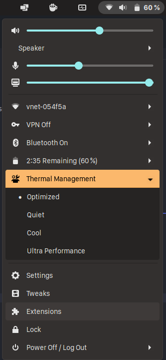

# dell-thermal-management
Dell Thermal Management extension for gnome-shell.



Now you can use [Dell CCTK tools](https://www.dell.com/support/kbdoc/pl-pl/000178000/dell-command-configure) for thermal management from status menu.

This plugin provide the ability to select from 4 thermal modes (optimized, cool, quiet and ultraPerformance), which are avaliable in Dell UEFI settings.

Any changes in UEFI settings are made at the user's own risk and I don't take any responsibility for them.

## Installation process:

1. Install Dell CCTK tools from official Dell's software page for your computer

2. Clone repository nad move into new directory

3. Build schemas
```sh
glib-compile-schemas schemas/
```

4. Copy entire project into extenstions (may require sudo permissions)
```sh
cp -r dell-thermal-management@dolszewski97.github.io ~/.local/share/gnome-shell/extensions/
```

5. Reload shell using ALT + F2 shortcut with 'r' command and enable the extension


## Thanks to

Based on gnome-shell-extension-dell-command-power-management made by vsimkus:
https://github.com/vsimkus/gnome-shell-extension-dell-command-configure-menu